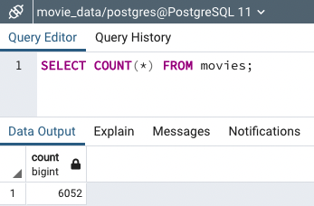
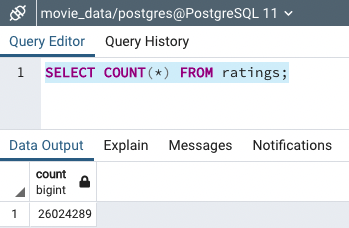

# Movie Data ETL

## Overview
The purpose of this project was to create a Python script using Pandas in Jupyter Notebook to automate the extract, transform, and load (ETL) process for Wikipedia and Kaggle movie data and MovieLens ratings data (via Kaggle) in order to create a PostgreSQL database of cleaned and merged movie data and ratings data. Three raw data files were used for this project: [Wikipedia JSON file](Resources/wikipedia-movies.json), [Kaggle metadata CSV file](Resources/movies_metadata.csv), and MovieLens ratings CSV file (not added to GitHub due to very large file size). 

## Project Components

### ETL Function to Read Three Raw Data Files
In the [first script](ETL_function_test.ipynb), a function was used to read in the three raw movie and ratings data files referenced above and create a DataFrame for each.

### ETL Function to Read and Clean Wikipedia Data
In the [second script](ETL_clean_wiki_movies.ipynb), the function was updated to read in the raw data files, clean the Wikipedia movie data, and create a clean Wikipedia DataFrame.

### ETL Function to Read and Clean Kaggle and MovieLens Data and Merge Data
In the [third script](ETL_clean_kaggle_data.ipynb), the function was updated to additionally clean the Kaggle movie data, merge the Wikipedia and Kaggle movie data in a clean movies DataFrame, and transform and merge the ratings data with the clean movie data in a DataFrame.

### Create Movie Database
In the [final script](ETL_create_database.ipynb), the function was updated to add the cleaned and merged movie data and the raw MovieLens ratings CSV data to a PostgreSQL database. Screenshots of queries confirming the successful creation and number of rows of the movies and ratings database tables are shown below. 

**Movies Table Row Count**

 

**Ratings Table Row Count**

 
